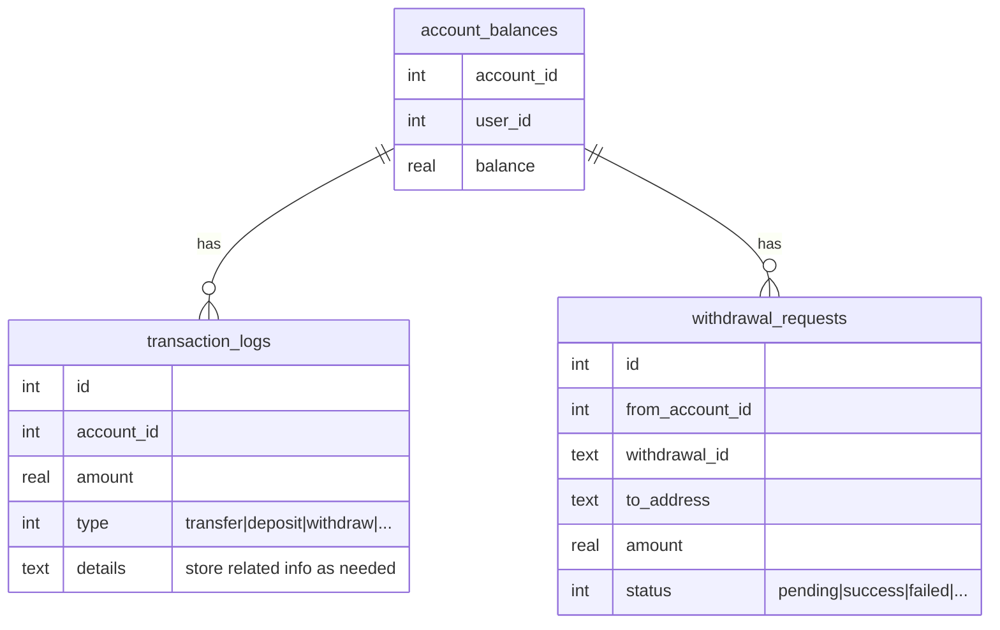

## Goals

1. Addressing concurrency issues when transferring money between accounts (please check TransferServiceTest for test scenarios)
2. Addressing the issue of withdrawal requests that are not immediately processed using a background job

## Data model



## Build & Run

```
mvn clean install
java -jar target/nvlproject-1.0-SNAPSHOT-jar-with-dependencies.jar
```


## APIs

#### Get all balances (for demonstration purposes)

```
curl -s  ocalhost:8080/balances | jq
{
"1": 1000000,
"2": 0,
"3": 0,
"4": 0,
"5": 0
}
```

### Transfer from one account to another
#### Transfer success
```
curl -s -XPOST localhost:8080/transfer -H 'content-type: application/json' -d '{"fromAccountId": 1, "toAccountId": 2, "amount": 10}' | jq
{
  "status": "success",
  "data": {
    "id": 1,
    "accountId": 1,
    "amount": 10,
    "details": "transfer to account 2",
    "type": "TRANSER"
  }
}
```

#### Transfer fail
```
curl -s -XPOST localhost:8080/transfer -H 'content-type: application/json' -d '{"fromAccountId": 1, "toAccountId": 2, "amount": 100000000 }' | jq
{
  "status": "failed",
  "error": 1
}
```

### Create a withdrawal request

```
curl -s -XPOST localhost:8080/withdraw -H 'content-type: application/json' -d '{"fromAccountId": 1, "address": "abcd", "amount": 10}' | jq
{
  "status": "success",
  "data": {
    "withdrawalId": "ccfeb15a-e5da-43f8-ab94-6f5dc2dc9b50"
  }
}

```

### Get withdrawal request status

```
curl -s -XGET localhost:8080/withdraw/ccfeb15a-e5da-43f8-ab94-6f5dc2dc9b50 | jq
{
  "status": "success",
  "data": {
    "id": 1,
    "fromAccountId": 1,
    "withdrawalId": "ccfeb15a-e5da-43f8-ab94-6f5dc2dc9b50",
    "toAddress": "abcd",
    "amount": 10,
    "status": "SUCCESS"
  }
}
```


## Benchmark

20 goroutines with 10s timeout for 10 seconds

```
go-wrk -T 10000 -c 20 -d 10 -M POST -H 'Content-Type: application/json' -body '{"fromAccountId": 1, "toAccountId": 2, "amount": 1}' 'http://localhost:8080/transfer'

33589 requests in 6.792161961s, 8.00MB read
Requests/sec:           4945.26
Transfer/sec:           1.18MB
Avg Req Time:           4.044277ms
Fastest Request:        378.917µs
Slowest Request:        3.042444041s
Number of Errors:       21 # database lock error ( could be handled with retry mechanism)

# Balance after transfer

curl -s localhost:8080/balances | jq 
{
  "1": 966411,
  "2": 33589,
  "3": 0,
  "4": 0,
  "5": 0
}

```